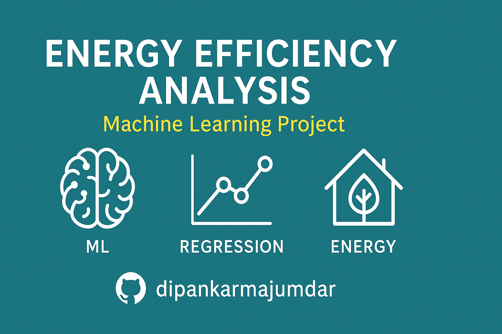

# Energy Efficiency Analysis 🏡

This project analyzes building energy efficiency and predicts **Heating Load** and **Cooling Load** based on various building features. It includes data preprocessing, model training, evaluation, and a Streamlit-based web application for predictions.

---



## Features ✨

- **Exploratory Data Analysis (EDA)**: Visualize and understand the dataset.
- **Data Preprocessing**: Clean and prepare data for machine learning.
- **Model Training**: Train a regression model to predict energy loads.
- **Model Evaluation**: Evaluate the model's performance using metrics like MAE, RMSE, and R².
- **Interactive Web App**: Use a Streamlit app to make predictions.

---

## Installation 🛠️

1. Clone the repository:
   ```bash
   git clone https://github.com/your-repo/energy-efficiency-analysis.git
   cd energy-efficiency-analysis
   ```

---

## Folder Structure 📂

Energy Efficiency Analysis/ ├── app/ # Streamlit application │ └── streamlit_app.py ├── data/ # Dataset │ └── uci-energy-efficiency-dataset.csv ├── models/ # Trained model and evaluation metrics │ ├── best_model.pkl │ └── metrics.json ├── notebooks/ # Jupyter notebooks for EDA │ └── eda.ipynb ├── src/ # Source code for data processing, training, and evaluation │ ├── data_preprocessing.py │ ├── evaluate.py │ ├── train_model.py │ ├── utils.py │ └── pycache/ # Compiled Python files ├── train.py # Main script for training and evaluation ├── requirements.txt # Python dependencies └── README.md # Project documentation

2. Install dependencies:
   ```bash
   pip install -r requirements.txt
   ```

---

## Usage 🚀

1. Exploratory Data Analysis (EDA)
   Run the Jupyter notebook to explore the dataset:

   ```bash
   jupyter notebook eda.ipynb
   ```

2. Train the Model
   Run the training script to preprocess data, train the model, and save it:

   ```bash
   python train.py
   ```

3. Launch the Web App
   Start the Streamlit app to make predictions:
   ```bash
   streamlit run app/streamlit_app.py
   ```

---

### Dataset 📊

The dataset is sourced from the UCI Machine Learning Repository and contains features like:

- Relative Compactness
- Surface Area
- Wall Area
- Roof Area
- Overall Height
- Orientation
- Glazing Area
- Glazing Area Distribution
- Heating Load
- Cooling Load

---

### Model Performance 📈

The model's performance metrics are saved in models/metrics.json:

- Heating Load:
  - MAE: 2.06
  - RMSE: 2.87
  - R²: 0.92
- Cooling Load:
  - MAE: 2.18
  - RMSE: 3.12
  - R²: 0.89

---

### Technologies Used 🛠️

- Python: Core programming language.
- Pandas: Data manipulation.
- NumPy: Numerical computations.
- Scikit-learn: Machine learning.
- Matplotlib & Seaborn: Data visualization.
- Streamlit: Web application framework.

---

Author ❤️
Built by Dipankar Maumdar using Python and Streamlit.
